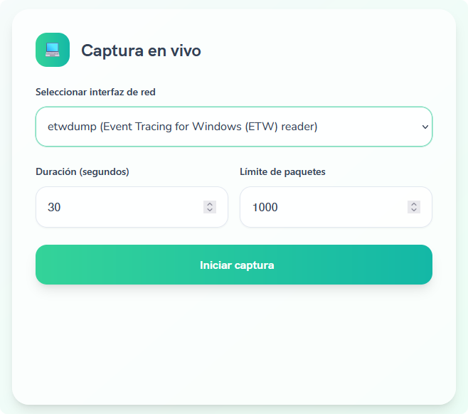
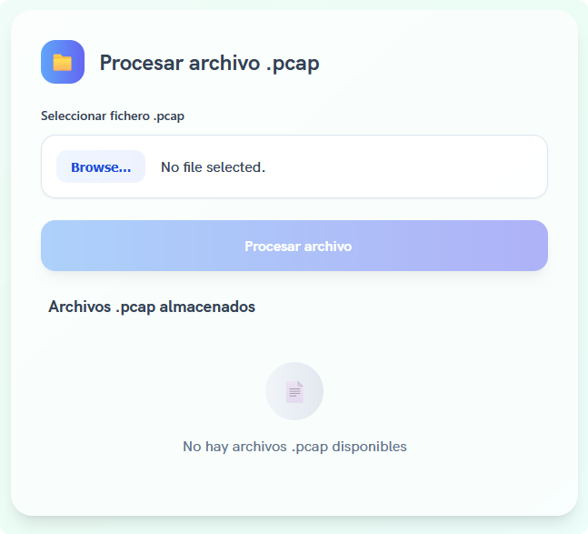
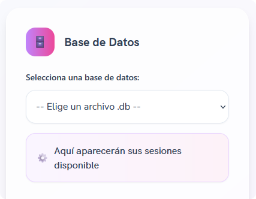
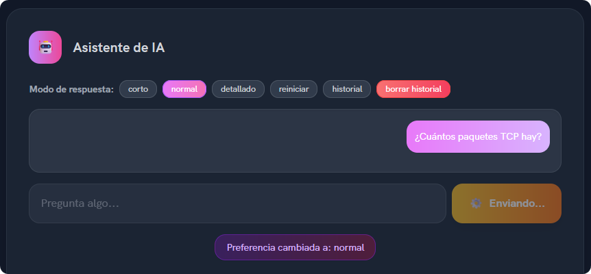

# Network Analyzer

Network Analyzer es una solución moderna y potente que combina tecnologías avanzadas de backend para la captura de paquetes con una interfaz web intuitiva y accesible. Perfecta para **profesionales de seguridad**, **administradores de red** y **estudiantes** que desean comprender y analizar el tráfico de red de manera eficiente. Existe una demo disponible en Google Drive por si se desea ver en detalle el flujo de trabajo y las funcionalidades principales de Network Analyzer: [Google Drive](https://drive.google.com/file/d/1qHAEe0JCK_XULsnjO2A1drE9YEcvGZdx/view?usp=sharing).

### 📋 Flujo de trabajo típico
La sencillez es uno de los puntos que más se ha tenido en cuenta al desarrollar Network Analyzer. Con una interfaz web simple e intuitiva, el resultado final está enfocado en la enficiencia y experiencia de usuario. El flujo de trabajo típico incluye los siguientes pasos:

En primer lugar nos encontramos con la captura de paquetes. Aquí el usuario
puede personalizar los parámetros, como seleccionar la interfaz de red específica y definir si desea capturar durante un tiempo determinado o hasta alcanzar un número concreto de paquetes. El
sistema lanza entonces un proceso secundario usando TShark, que se encarga de interceptar cada
paquete que atraviesa la interfaz seleccionada.

<div align="center">
    
</div>

Una vez finalizada la captura se da paso al procesamiento de los datos, tarea que se ejecuta de manera automática. El sistema realiza algunas validaciones: verifica que el archivo `.pcap` seleccionado por el usuario no esté corrupto, que tenga un formato compatible y estima el tiempo que tomará el procesamiento según su tamaño. 

<div align="center">
    
</div>

Cada paquete capturado es entonces desglosado meticulosamente por capas y la información se almacena en una base de datos SQLite optimizada, lo que genera el archivo `.db` que se utilizará posteriormente.

<div align="center">
    
</div>

Es en este último paso donde Network Analyzer se vuelve realmente útil. Cuando el usuario selecciona una sesión para su análisis, se carga automáticamente un resumen estadístico de esa captura. Se configura un prompt especializado para que Claude entienda que debe actuar como analista de red, y se prepara un historial vacío para la conversación, asegurando un análisis limpio desde el inicio. En cada consulta, el sistema interpreta lo que el usuario quiere
saber mediante técnicas de procesamiento de lenguaje natural. Finalmente, la IA genera una respuesta adaptada al nivel de detalle que el usuario desee: puede ser breve, normal o muy técnica. La respuesta no solo incluye datos concretos, sino también interpretaciones, explicaciones y recomendaciones. Se preserva el contexto de la conversación, por lo que es posible hacer preguntas encadenadas sin perder el hilo.

<div align="center">
    
</div>

---

## ¿Qué funcionalidades ofrece Network Analyzer?
- **Captura paquetes de red** en tiempo real desde cualquier interfaz  
- **Analiza con IA** el tráfico usando consultas en lenguaje natural  
- **Visualiza estadísticas** detalladas y comportamientos de red  
- **Detecta anomalías** y posibles amenazas automáticamente  
- **Almacena datos** estructuradamente para análisis posteriores  
- **Interactúa conversacionalmente** para explorar los resultados

## Arquitectura del Proyecto

El proyecto está construido con una **arquitectura moderna de microservicios** dividida en dos componentes principales:

#### Backend (Python/FastAPI)

| Módulo | Descripción | Tecnología |
|--------|-------------|------------|
| **Captura** | Interfaces con TShark para captura de paquetes | TShark/Wireshark |
| **Procesamiento** | Convierte archivos PCAP a estructuras analizables | Pandas/Python |
| **Base de datos** | Almacenamiento SQLite de sesiones y anomalías | SQLite |
| **API REST** | Endpoints para todas las funcionalidades | FastAPI |
| **Integración IA** | Conexión con Claude AI para análisis inteligente | Anthropic Claude |

#### Frontend (React)

| Componente | Función | Tecnología |
|------------|---------|------------|
| **Interfaz visual** | Diseño moderno y responsivo | React + TailwindCSS |
| **Captura** | Panel para iniciar capturas o subir PCAPs | React Components |
| **Análisis** | Visualización de paquetes y estadísticas | Chart.js |
| **Chat IA** | Interfaz conversacional para consultas | WebSocket + React |

## ✨ Funcionalidades Principales

> **Todo lo que necesitas para análisis de red profesional**

###  Captura y Procesamiento
- **Captura en tiempo real** desde cualquier interfaz de red
- **Procesamiento de archivos PCAP** existentes
- **Almacenamiento inteligente** en bases de datos SQLite optimizadas
- **Detección automática** de anomalías y patrones sospechosos

###  Análisis y Visualización
- **Estadísticas avanzadas** de tráfico (protocolos, IPs, puertos)
- **Visualización interactiva** de datos de red
- **Alertas inteligentes** para comportamientos anómalos
- **Reportes detallados** exportables

###  Inteligencia Artificial
- **Chat conversacional** para consultas en lenguaje natural
- **Modos de respuesta configurables** (corto, normal, detallado)
- **Análisis inteligente** de patrones de tráfico
- **Predicción de amenazas** basada en comportamientos

## 🛠️ Instalación y Configuración

> **Puesta en marcha de manera rápida y sencilla**

### Paso 1: Obtener el Código

```bash
# Clona el repositorio
git clone https://github.com/tu_usuario/network-analyzer.git
cd network-analyzer
```

### Paso 2: Configurar el Backend

<details>
<summary><strong>Configuración detallada del backend (desplegable)</strong></summary>

#### 2.1 Crear entorno virtual
```bash
# En Windows
python -m venv venv
venv\Scripts\activate

# En Linux/macOS
python3 -m venv venv
source venv/bin/activate
```

#### 2.2 Instalar dependencias
```bash
cd backend
pip install -r requirements.txt
```

#### 2.3 Configurar variables de entorno
Crea un archivo `.env` en la carpeta `backend` con:
```env
# Configuración de IA
ANTHROPIC_API_KEY=tu_clave_api_de_anthropic

# Configuración del servidor
HOST=localhost
PORT=8000
DEBUG=true

# Configuración de directorios
DATABASE_DIRECTORY=./data/db_files
PCAP_DIRECTORY=./data/pcap_files
```
</details>

### Paso 3: Configurar el Frontend

```bash
# Navegar al directorio del frontend
cd ../frontend

# Instalar dependencias
npm install
```

## Cómo usar Network Analyzer

#### Backend (Servidor API)
```bash
cd backend
python run.py
```
 **Servidor disponible en:** `http://localhost:8000`

#### Frontend (Interfaz Web)
```bash
cd frontend  
npm run dev
```
**Interfaz disponible en:** `http://localhost:5173`

## 💬 Ejemplos de consultas

### Consultas básicas
```
 "¿Cuáles son los protocolos más utilizados en esta captura?"
 "¿Qué IPs han generado más tráfico?"
 "Muéstrame un resumen de la actividad de red"
 "¿Cuántos paquetes se capturaron en total?"
```

### Análisis de seguridad
```
 "¿Hay indicios de escaneos de puertos en esta sesión?"
 "¿Puedes identificar alguna actividad sospechosa?"
 "¿Hay patrones de comunicación anómalos?"
 "¿Detectas algún intento de intrusión?"
```

### Análisis estadístico
```
 "¿Cuáles son las comunicaciones más frecuentes entre hosts?"
 "¿Qué puertos están siendo más utilizados?"
 "¿Hay algún pico de tráfico inusual?"
 "Analiza la distribución de protocolos por tiempo"
```

###  Investigación forense
```
 "¿Qué hizo la IP 192.168.1.100 durante la captura?"
 "¿Hay transferencias de archivos sospechosas?"
 "¿Qué dispositivos se conectaron durante este período?"
 "Analiza las conexiones salientes no autorizadas"
```

## 📄 Licencia

Este proyecto está desarrollado bajo la **Licencia MIT**.

###  Desarrollador principal
**Jonathan Carrero**  
**Email:** jonathan.carrero@alumnos.ui1.es  
**Institución:** Universidad Isabel I  

### Contribuciones
Las contribuciones son siempre bienvenidas, pero por favor:
1.  **Fork** el proyecto
2.  **Crea** una rama para tu feature
3.  **Commit** tus cambios  
4.  **Push** a la rama
5.  **Abre** un Pull Request

---
*Created by Jonathan Carrero*

[](https://python.org)
[](https://fastapi.tiangolo.com)
[](https://reactjs.org)
[](LICENSE)